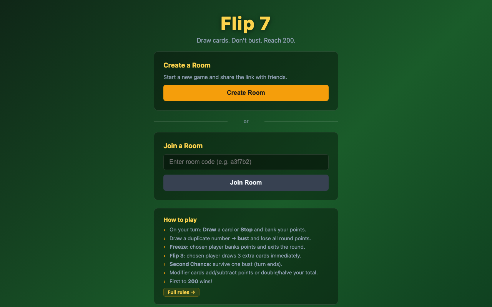
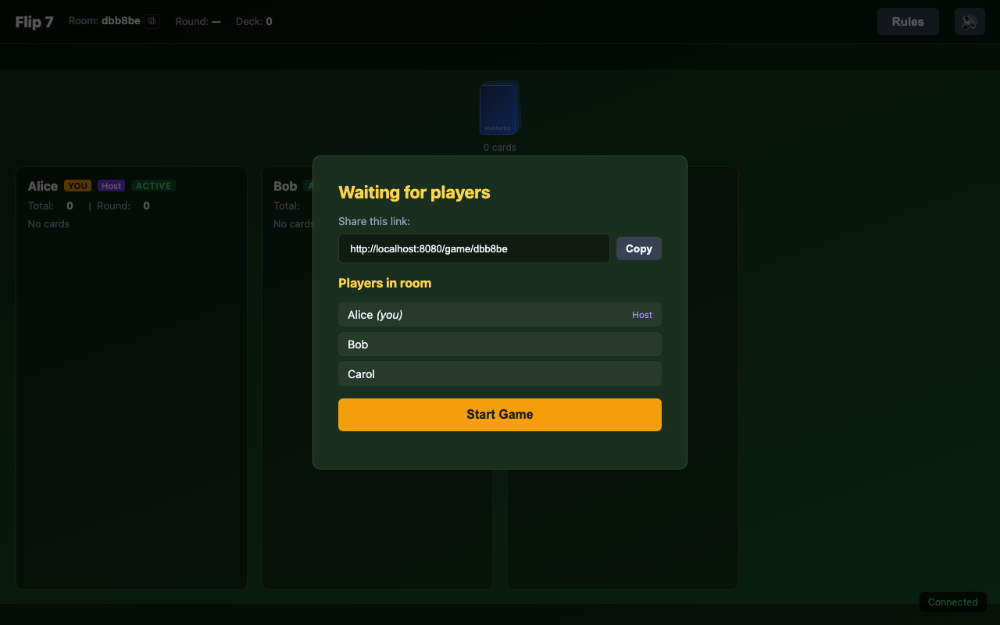
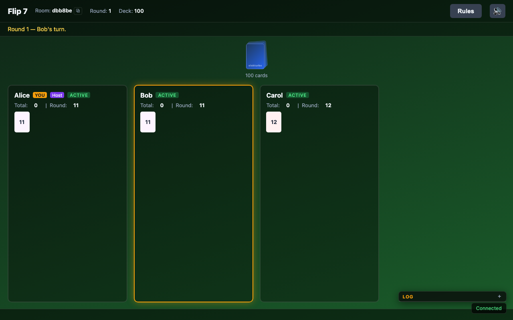
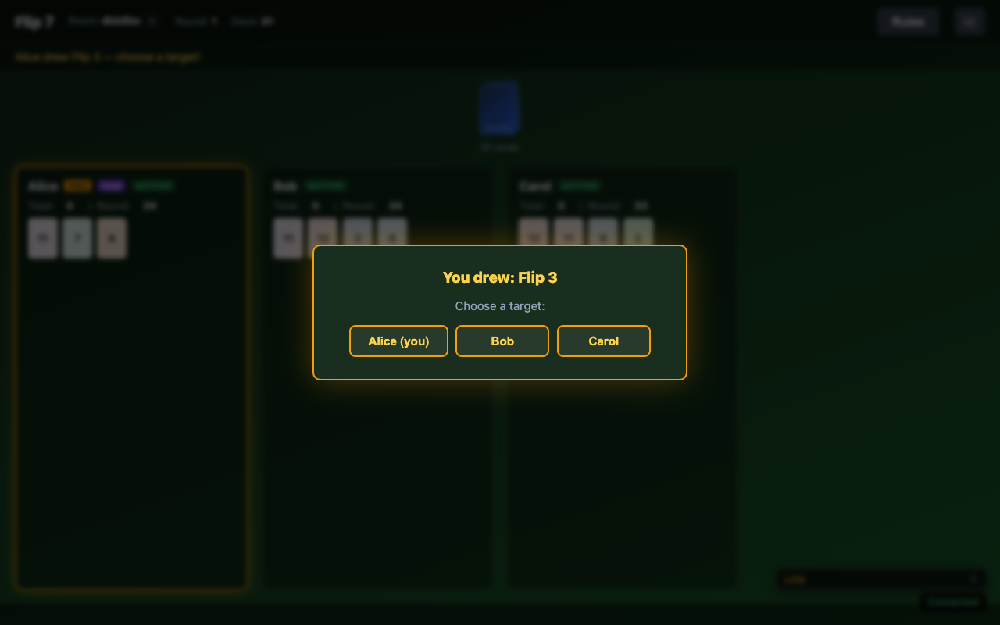
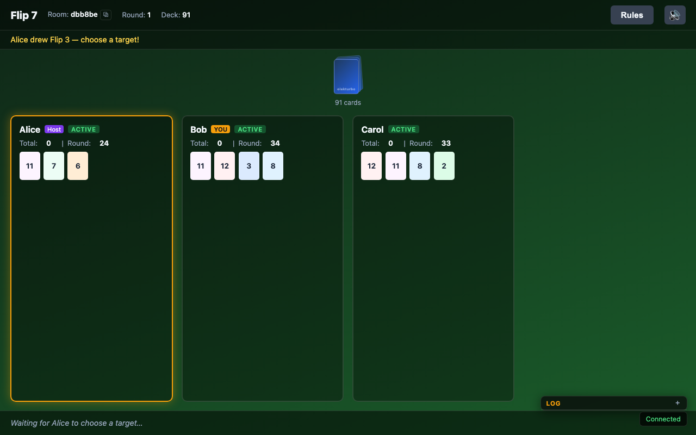
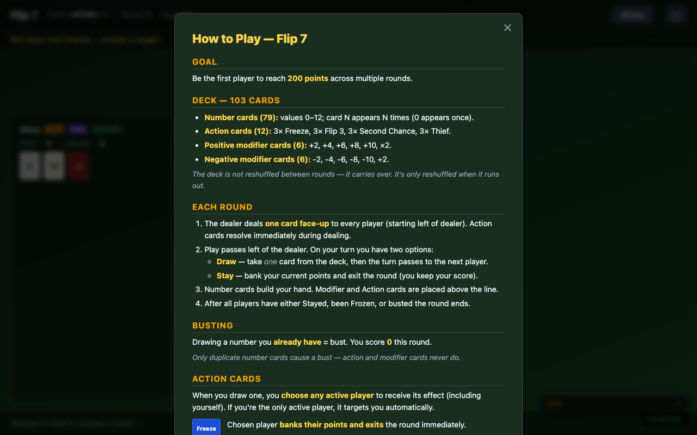

# Flip 7 — Multiplayer Web Game

[](https://github.com/olekturbo/flip/actions/workflows/ci.yml)
[](https://codecov.io/gh/olekturbo/flip)

A faithful digital adaptation of the **Flip 7** card game by [The Op](https://theop.games/pages/flip-7), playable in the browser with 2–6 players over WebSockets.

## Playing the Game

1. Open the app and enter your name.
2. Share the room URL with friends.
3. The host presses **Start** when everyone is in.
4. Take turns drawing cards or stopping — first to **200 points** wins.

Rules are available in-game via the **Rules** button.

## Screenshots

| Home | Lobby |
|:----:|:-----:|
| [](screenshots/01_home.png) | [](screenshots/03_lobby_three_players.png) |

| Game board | Action card — Flip 3 |
|:----------:|:--------------------:|
| [](screenshots/04_game_start_alice_pov.png) | [](screenshots/07_mid_game_alice.png) |

| Mid-round | Rules |
|:---------:|:-----:|
| [](screenshots/08_mid_game_bob.png) | [](screenshots/12_rules_modal.png) |

## Rules

Draw cards, don't bust, first to **200 points** wins. On your turn: **Draw** one card or **Stay** to bank your points. Drawing a duplicate number = bust (0 points that round). Action cards (Freeze, Flip 3, Second Chance, Thief) and modifier cards (+/−/×2/÷2) add strategy. Collecting 7 unique numbers triggers **Flip 7** — round ends immediately with a +15 bonus.

→ **[Full rules](RULES.md)**

---

## Running Locally

```bash
go run ./cmd/server        # serves at http://localhost:8080
```

Requires Go 1.22+. No other dependencies — the frontend is vanilla JS/CSS with no build step.

## Tests

```bash
go test ./internal/game/...
```

The test suite has two layers:

**Unit / scenario tests** (`*_test.go`) — Go's standard `testing` package:

| File | What it tests |
|------|---------------|
| `deck_test.go` | Deck composition — 103 cards, correct counts per type and value |
| `player_test.go` | `RoundScore()` (table-driven), `HasNumber()`, `UniqueNumberCount()` |
| `game_test.go` | Game mechanics — draw, bust, Second Chance, Stop, Freeze, Flip 3, Flip 7, Thief, win condition, tie at 200+, dealing-phase SC, valid targets, player management |

**BDD feature tests** (`bdd_test.go` + `features/*.feature`) — [godog](https://github.com/cucumber/godog) with Gherkin:

| Feature file | What it documents |
|---|---|
| `scoring.feature` | All score combinations: plain numbers, ×2, ÷2, +/- modifiers, minimum zero |
| `bust.feature` | Bust on duplicate number; modifiers never bust |
| `second_chance.feature` | SC prevents bust, consumed on use, auto-resolves with single target, Flip 3 draws continue after save |
| `freeze.feature` | Freeze targeting, auto-target, banked score |
| `flip3.feature` | 3 forced draws, stops on bust or Flip 7 only, deferred action resolution |
| `flip7.feature` | 7 unique numbers ends round, +15 bonus, active players bank |
| `thief.feature` | Two-stage steal: choose player then card; discarded when nothing to steal; Flip 7 on stolen 7th |
| `round_and_game.feature` | Score accumulation, win at 200+, tie continuation, bust at threshold |

The feature files serve as **living documentation** of the rules — readable without knowing Go. Game-mechanics tests bypass the dealing phase by constructing state directly (same-package access), then drive actions through the public API (`Draw`, `Stop`, `Target`).

## Docker

```bash
docker build -t flip7 .
docker run -p 8080:8080 flip7
```

Static files are embedded in the binary at compile time (`//go:embed web`).  
Set the `PORT` environment variable to override the default port 8080.

## Project Structure

```
cmd/server/          Entry point (HTTP server, PORT env var)
internal/
  api/               HTTP router (REST + WebSocket upgrade)
  hub/               Room and client lifecycle, WebSocket handling
  game/              Game logic, state machine, scoring
web/
  css/style.css      All styles (game page + mobile)
  js/app.js          Vanilla JS client (WebSocket, rendering, animations)
  index.html         Landing page
  game.html          Game page + in-game rules modal
embed.go             //go:embed directive (bakes web/ into binary)
Dockerfile           Two-stage build (golang:1.22-alpine → alpine:3.19)
```

## Tech Stack

- **Backend:** Go, [`nhooyr.io/websocket`](https://github.com/nhooyr/websocket)
- **Frontend:** Vanilla JS + CSS — no framework, no build step
- **Transport:** WebSocket with 15 s ping / 5 s timeout; full state broadcast on every change
- **Persistence:** In-memory only; rooms expire after 10 minutes empty
